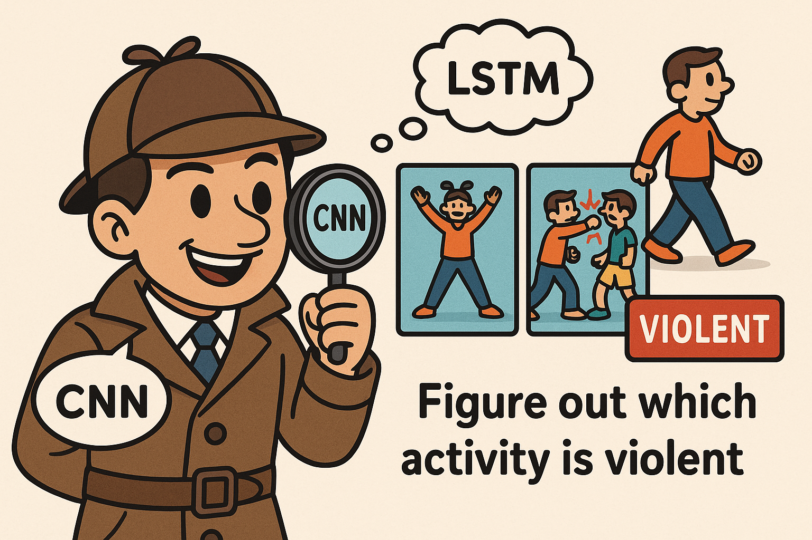

# Intelligent Violence Detection System

A deep learning-based system for detecting violent behavior in videos using CNN + LSTM + Attention. This project includes model training, evaluation, and a Streamlit web application for inference on uploaded videos or live webcam feed.

---

## 🧠 Model Architecture


- **CNN**: Pretrained ResNet18 for feature extraction
- **LSTM**: Temporal modeling of frame sequences
- **Attention**: Learnable attention over time steps
- **Classifier**: Fully connected layer for binary classification

---

## 📊 Dataset

1. **Real Life Violence Situations Dataset**  
   [Kaggle Link](https://www.kaggle.com/datasets/mohamedmustafa/real-life-violence-situations-dataset)

2. **RWF-2000 Dataset**  
   [Kaggle Link](https://www.kaggle.com/datasets/vulamnguyen/rwf2000)

---

## 📁 Project Structure

```
violence-detection/
├── model.py                 # Model definition (CNN + LSTM)
├── utils.py                 # Helper functions (frame extraction, etc.)
├── dataset.py               # Data preprocessing functions 
├── checkpoints/             # Saved models
├── train.py                 # Main training script
├── appStreamlit.py          # Streamlit application
├── flaskApp.py              # Flask application
├── live\_detection.py       # Real-time webcam inference
├── evaluate.py              # Evaluation & classification report
├── requirements.txt         # Required Python packages
└── README.md                # Project overview

````

---

## ⚙️ Installation

```bash
# Clone the repo
git clone https://github.com/Soufiane-JADDA/violence-detection.git
cd violence-detection

# Create a virtual environment
python3 -m venv env
source env/bin/activate

# Install dependencies
pip install -r requirements.txt
````
---
To ensure your code runs correctly, especially when training or evaluating your model, **you must update the dataset path** to match the actual location on your system.

For example, in your `train.py` or any other script using the dataset:

```python
DATA_PATH = "/path/to/your/dataset"
```

Replace `/path/to/your/dataset` with the **actual** path where your dataset is stored. For example:

```python
DATA_PATH = "/mnt/SDrive/temp/datasetFight"
```

✅ This change is essential to avoid `FileNotFoundError` or silent loading of empty datasets.

Would you like me to review or generate a setup script that automatically checks or prompts for this path?


---

## 🏋️‍♂️ Training the Model
You can modify training parameters like learning rate, batch size, number of epochs, etc., directly inside the main() function.
! important to changes path of dataset to you actual dataset path
```bash
python train.py
```

About the model:

* Trained using the Real-Life Violence Dataset and RWF-2000
* Saved checkpoints and the best model (`violence_detector_best.pt`)
* Plotted training and validation loss over epochs

---
📺 Flask or Streamlit App 
Launch the web app:

```bash
streamlit run appStreamlit.py
```
or for Flask app:
```bash
python flaskApp.py
```
Features:

- Upload and analyze videos for violence

- Live detection from webcam with configurable webcam index

---
## 🎥 Real-Time Detection (Webcam)

```bash
python live_detection.py
```

You will see video frames and detection status:

* 🟢 **NON-VIOLENT**
* 🚨 **VIOLENT** (if probability > 80%)

---

## 📊 Evaluation

Run classification report and confusion matrix:

```bash
python evaluate.py
```

You’ll get:

* Precision / Recall / F1-score
* Confusion matrix
* Misclassified samples saved for analysis

---

## 🧪 Sample Output

```
Classification Report:
              precision    recall  f1-score   support
 Non-Violent       0.98      0.92      0.95      1000
     Violent       0.92      0.98      0.95      1000
 Accuracy                              0.95      2000
```

---

## 🤝 Contributing

Pull requests are welcome! For major changes, please open an issue first.

1. Fork the project
2. Create your feature branch: `git checkout -b feat/feature-name`
3. Commit your changes: `git commit -m 'Add feature'`
4. Push to the branch: `git push origin feat/feature-name`
5. Open a pull request

---

## 📜 License

This project is licensed under the [MIT License](LICENSE).

---

## 🙋‍ Maintainer

**Soufiane Jadda**

* GitHub: [@Soufiane-JADDA](https://github.com/Soufiane-JADDA)
* Email: [soufiane.jadda@usmba.ac.ma](mailto:soufiane.jadda@usmba.ac.ma)
